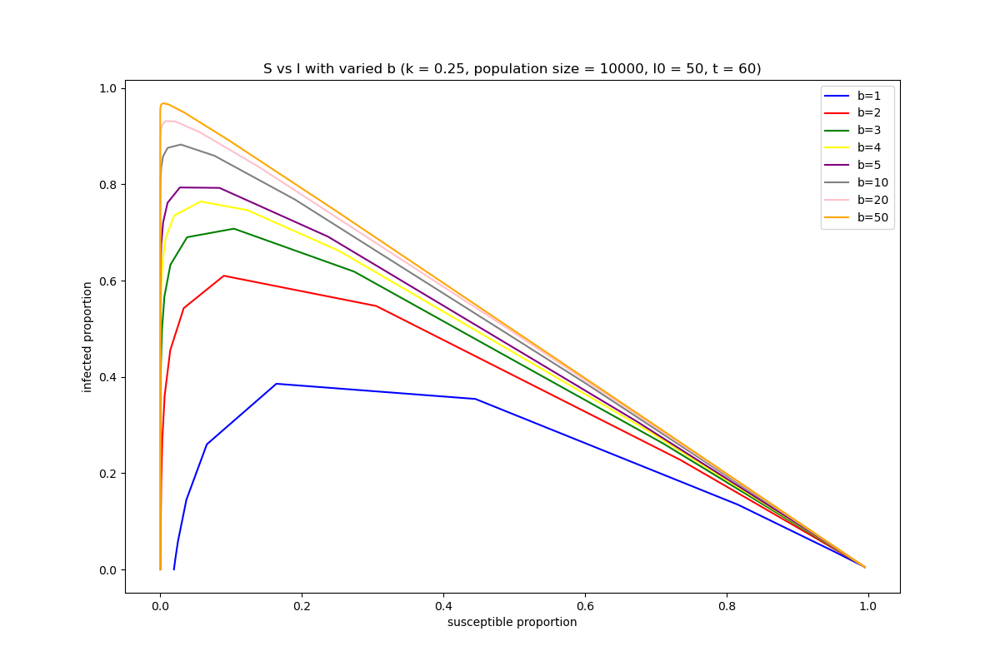
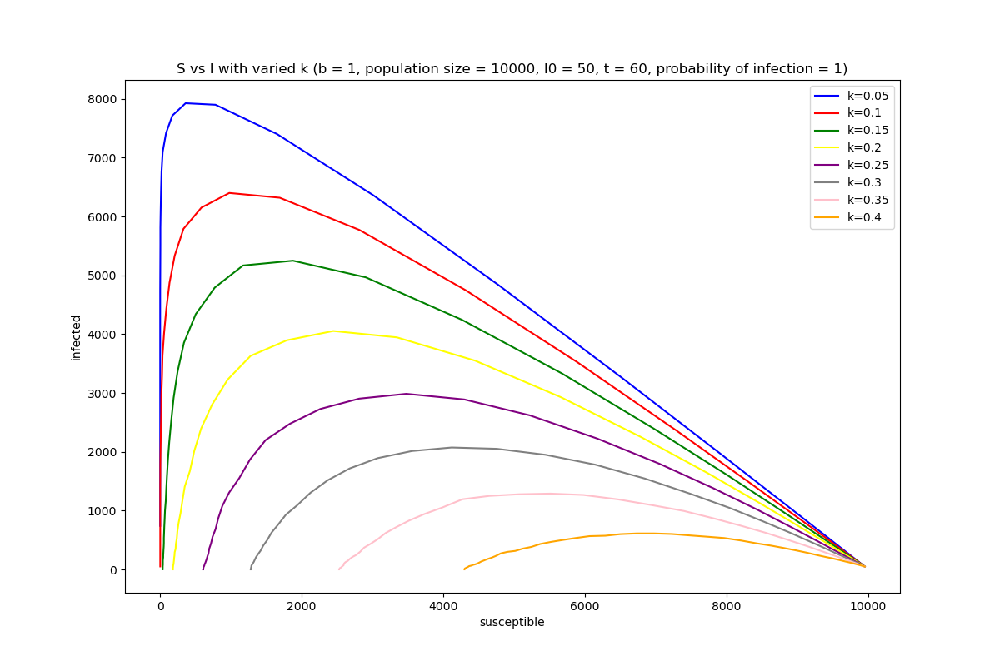
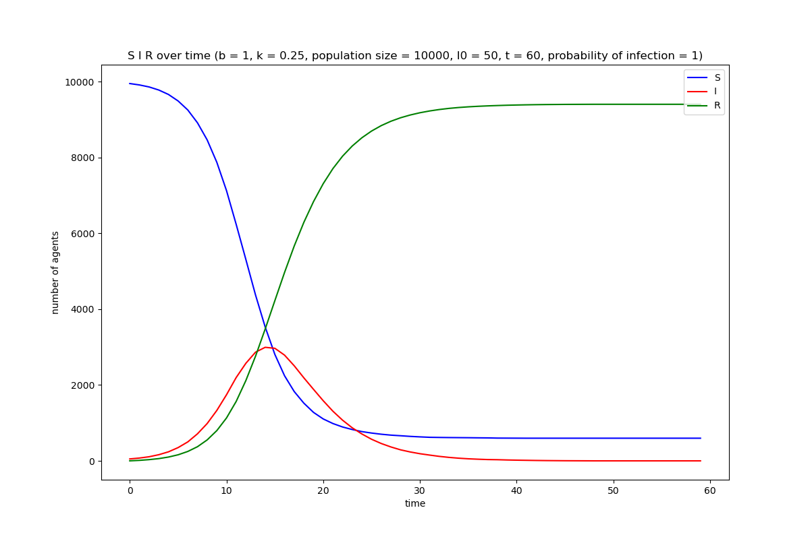
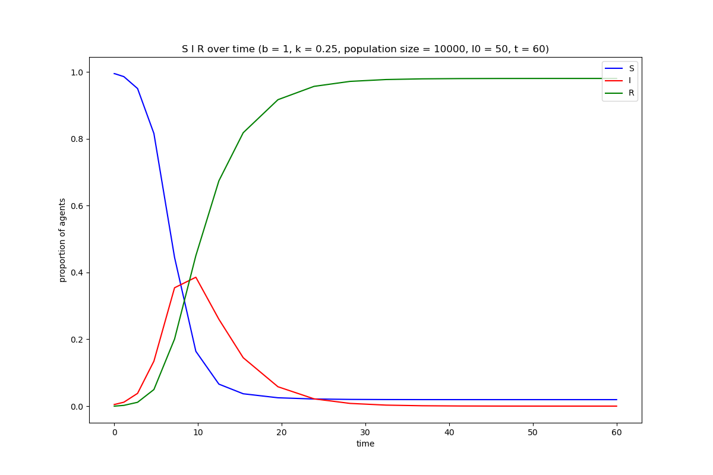

# Introduction to SIR method and terminology

# Structure of SIR python package

# Preliminary investigations

We investigate a variety of different simulations and will discuss a few of the most interesting visualizations in this section. Generally, it is important to understand the factors that drive a virus to spread and then use that information to best understand how to stop it. The first factor we will investigate is "b", the infections per day per agent, and try to understand what exactly this does to the timeline of a virus. To analyze this effect we assume moderate parameters and vary the value of b. We plot the number of susceptible individuals against the number of infected people over the course of the simulation in all of the phase diagrams in this report (note that we use a proportion for the continuos case and the raw number for the discrete agent case):

We observe that, as expected, the lower the value of b, the slower that the infection spreads, and in cases where b is low, sometimes the disease is totally eradicated before everyone has been infected. Furthermore, both of the methods produce similar results, so we can confidently say that more infections per infected person, increases the rate of spread.

Next, we look at the effect of "k", the recovery coefficient, on the spread of the virus. Intuitively, we would expect a higher value of k to lead to slower spread of the virus through fewer people being able to transmit the virus at any given time:

Again, the results make intuitive sense, and it is beginning to become clear that while the the two different methods provide similar dynamics, the agent based approach provides more conservative estimates of how quickly the virus will spread than the ODE based approach. So, we should investigate some specific cases to see how the two approaches differ, and what that may mean.

Now that we understand how the parameters effects the timeline of the virus we will analyze the SIR time series from a few simulations and connect them to the phase diagrams above. The following two plots show the number (or proportion) of infected agents in a situation that results in almost the entire population being infected at one point or another:

We again observe that the ODE approach is more pessimistic it is projections. We see that the majority of infections happen early, and then after about 15 days in the case of the agent based model and 10 in the ODE model, the recovery rate exceeds the infection rate. This case follows one of the lines of the phase diagram where the line terminates at the s=0 i=0 location. Now lets look at a case where the two models do not match up very well:

These two models have the same parameters, yet the pessimism of the ODE model seems to create drastically different results than the agent based approach. This seems odd at first, but a small nudge in the direction of increased infections can lead to a much worse outcome overall. For example, consider that the infection rate is the same as the recovery rate if there are 50 agents that are infected. Then, we could expect the number of agents who are sick to not increase that much. However, if we nudge that number up a little bit, say to 70, then we have pushed the system out of equilibrium and the infections may get out of control, this is the idea of flattening the curve and trying to keep the number of infections manageable. This may indicate that the ODE approach is more susceptible to random shocks to the system than the agent based approach, which is something that we must take into account in the future steps. (we provide additional plots from various other cases in the plots folder, which are interesting to look at but do not provide much more interesting analysis).

These initial simulations highlight three key observations that will be very important in the next steps of this project. First, the choices of parameters b and k define the life cycle of the virus in a population and should be tuned such that the dynamics that we are interested in studying, whether that be knowledge about the virus accumulated by populations or the effect of the possibility of reinfection, is not overpowered by our choice of infection and recovery rate. Second, it is important to take into account multiple types of models when simulating the spread of a virus as even though the models may seem to have similar dynamics overall they may have drastically different projections for certain cases. Finally, model sensitivity is important to take into account when considering its projections. If we have a model that will tumble in whatever direction it is pushed, we had better make sure that those dynamics make sense.

# Extensions
## Extension - Anna

A variation we would like to implement is to account for reinfection in the S, I, R model. With some viruses, even if infection leads to immunity in most, there is some probability of reinfection. Preliminary studies have found this to be the possible with coronavirus. 
1.	In the final report, we would like to show how reinfection influences the spread of the infection. This would include the size of infected population and the rate at which the infection spreads. 
2.	Implementing this from an ODE perspective, this would mean including in the rate of change of susceptible population a term connected with the recovered population’s probability of reinfection. This would also include accounting for recovered person’s who became infected again in the representation of the recovered population.
3.	If we want to model this as the coronavirus, limited information about reinfection rates can be found in a paper by Murillo-Zamora et al.
4.	Reference: Murillo-Zamora E.; Mendoza-Cano O.; Delgado-Enciso I.; Hernandez-Suarez C. M. Predictors of Severe Symptomatic Laboratory-Confirmed Sars-Cov-2 Reinfection. *medRxiv* **2020**, 2020.10.14.20212720.

## Extension - Jack

## Extension - Jarrod

The reactions of individuals and organizations is one of the most important factors in curbing the spread of a disease; however, information about what slows the spread, what harms the individuals, and who is susceptible to the disease is not always public information. Masks have been politicized and are widely used by certain groups whereas in others they are almost unanimously rejected as a valid form of defence against the virus. At one point we assumed that you could not be reinfected by the virus, while now there is information that supports that you can indeed get infected more than once. Overall, the virus is confusing and people act irrationally. We want to explore how the way people learn about the virus effects the spread of the disease, and how knowledge about the disease spreads in parallel to the disease itself.
1.  There are a variety of questions that are interesting, but mainly we want to study how information about the disease clusters within a population and how that effects the spread of disease. Those in close proximity to the disease are likely to learn more about the disease itself, but at the same time they are more likely to get it. Also, what if there is a source of misinformation in the system, can this misinformation increase the rate of infection?
2.  We can implement this in the agent model in a 2 dimensional space, where agents learn about the virus from those around them getting infected. We can add parameters to the agent class such as "fear" (that would make an agent less likely to interact with others), "knowledge" (that would make agents less likely to contract the disease in and interaction), and a variety of other information based parameters. We also may be interested in allowing agents to move within the area of the simulation, does social distancing arise?
3.  This idea will not involve data, but it will be important to understand dynamics of interaction under knowledge sets. To support our assumptions about how agents react to information we may refer to ideas from economics. We cite some texts below that are related to optimizing given information sets.
4.  - Kamien, Morton I., and Nancy Lou Schwartz. Dynamic Optimization the Calculus of Variations and Optimal Control in Economics and Management. Dover Publications, 2012. 
    - Osborne, Martin J. An Introduction to Game Theory. Oxford University Press, 2017. 
    - Fleming, Nic. “Coronavirus Misinformation, and How Scientists Can Help to Fight It.” Nature News, Nature Publishing Group, 17 June 2020, www.nature.com/articles/d41586-020-01834-3. 

