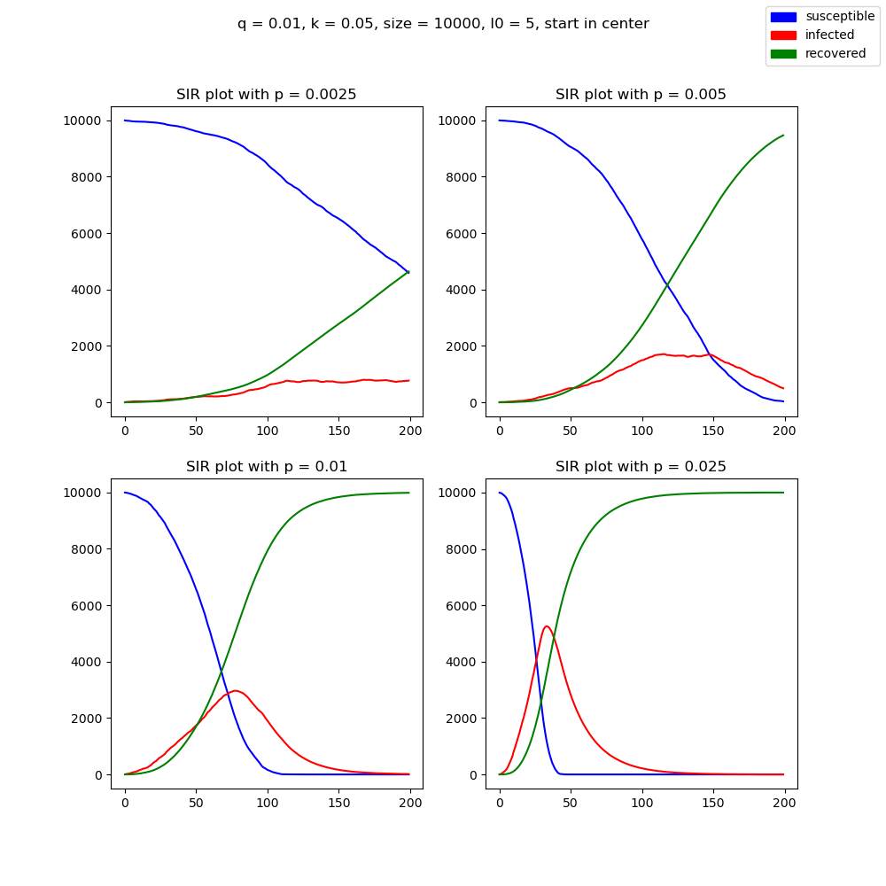
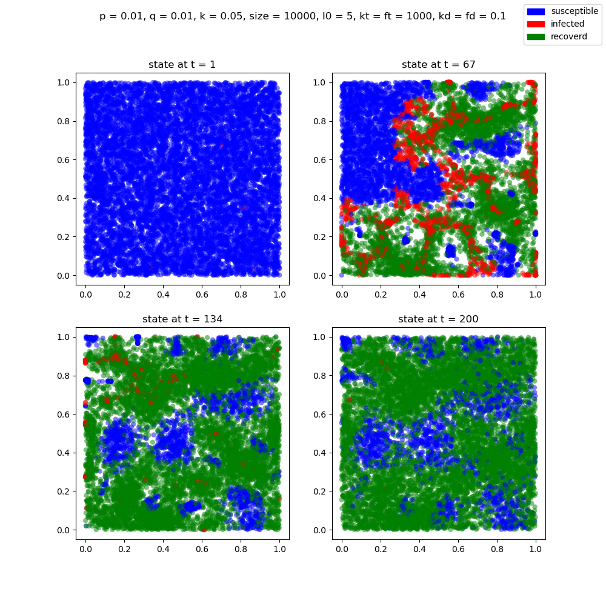

# Introduction to SIR method and terminology
The SIR model is a method for modeling the spread of disease in a population based on the idea that the individuals in the population fall in to one of three categories: susceptible, removed, or infected. Susceptible individuals have not yet gotten the disease and are in danger of contracting it. Infected individuals are carriers of the disease and spread it to others. Removed individuals have either recovered from the disease or died, so are no longer susceptible to it. We have implemented this method using both an Agent-based model and a system of ODEs. Furthermore, we explore the SIR model both with a spatial component and without. For the spatial case, both methods use parameters `p`, `q` and `k` to represent how the disease spreads. The parameter `p` represents the maximum distance that an agent can move per period, `q` represents the radius around an infected individual that the disease can spread, and `k` represents the fraction of the infected population that recovers each day. In the traditional SIR model with no spatial component, `p` and `q` are replaced with one variable `b`, which represents the number of infected agents per infected agent per period. In our discussion of these models we have used the following notation:
  
  `i = fraction of the population that is infected (initial conditions i0)`
  
  `I = absolute number of infected individuals (initial conditions I0)`
  
  `r = fraction of the population that is removed (initial conditions r0)`
  
  `R = absolute number of removed individuals (initial conditions R0)`
  
  `s = fraction of the population that is susceptible (initial conditions s0)`
  
  `S = absolute number of susceptible individuals (initials conditions S0)`
  
  `N = number of individuals in the population`
  
  `t = time`

The Agent-based model uses interactions between infected individuals and susceptible individuals to trace the spread of the disease. The ODE method uses time dependent variables for each of the three possible states to model the spread of the disease. The evolution of these variables is described by the system of equations:
  
  `ds/dt = -b * s(t) * i(t)`
  
  `dr/dt = k * i(t)`
  
  `di/dt = b * s(t) * i(t) - k * i(t)`

We also explore three extensions to the above models, two of them being related to the agent based model and the other being related to the ODE model. We provide a brief introduction to each:
1.  We explore how the spread of the virus is effected if the agents take some effort to socially distance themselves from others, if given enough information about the disease. We define the following parameters that are specific to this extension:

    `knowledge_distance (kd) = the radius around an individual from which they can gather knowledge` 

    `knowledge = the cumulative sum of infected and recovered individuals within the knowledge_distance of an individual`

    `knowledge_threshold (kt) = the knowledge score that an infected agent must have to socially distance itself from healthy agents`

    `fear_distance (fd) = the radius around an individual from which they can gather become more fearful of the disease` 

    `fear = the cumulative sum of infected individuals within the fear_distance of an individual`

    `fear_threshold (ft) = the fear score that a healthy agent must have to socially distance themselves from infected agents`

Once a healthy agent achieves a fear score above the threshold level, they will then chose the location within a distance `p` that maximizes the sum of distances between them and any infected agents that are within the `fear_distance` from them. Furthermore, once an infected agent achieves a knowledge score above the threshold level, they will maximizes the sum of distances between them and healthy individuals within the `knowledge_distance` from them. Recovered individuals, and individuals that have not surpassed threshold levels do not act in any intelligent manner so they just chose a random location, within radius `p`, to move to each period.

# Structure of SIR python package

The `sir` package contains thee submodules: One, `agent`, contains class definitions for `Agent` and `DiscreteAgentModel`, which are necessary to carry out the discrete agent simulations with no spatial component. Two, `ode`, contains the class definition for `OdeSir`, which is necessary to carry out the ODE version of the problem. Three, `smartagent`, contains class definitions for `SmartAgent` and `SmartAgentModel2D`, which are necessary to carry out the discrete agent simulations with spatial component, and can be used to model "intelligent" agent behavior along with the standard random behavior.
  

# Basic SIR model

We investigate a variety of different simulations but will discuss only the most interesting in this section (for more on this model and a discussion of other simulations see the midterm checkpoint). The choice of `b` and `k` is of great importance in how both of these methods model the spread of disease through a population. The higher `k` is the faster any given individual will recover from the disease, and thus the less time they will be able to infect people. On the other hand, a high `b` will lead to many agents being infected each period. Ultimately, increasing the initial number infected or `b` generally will lead to more people getting infected faster and the disease being more successful overall, while increasing `k` will have the opposite effect.

Generally the ODE model and the agent based model provide similar dynamics to how the virus will progress through a population. However, we chose to highlight a simulation in which the two approaches do not agree:

These two models have the same parameters, yet the the ODE model seems to create drastically different results than the agent based approach. This seems odd at first, but a small nudge in the direction of increased infections can lead to a much worse outcome overall. For example, consider that the infection rate is the same as the recovery rate if there are 50 agents that are infected. Then, we could expect the number of agents who are sick to not increase that much. However, if we nudge that number up a little bit, say to 70, then we have pushed the system out of equilibrium and the infections may get out of control, this is the idea of flattening the curve and trying to keep the number of infections manageable. This example is important to keep in mind for not only the spatial model, but the extensions as well as it indicates how important our model assumptions are to the dynamics of a disease.

# SIR model with spatial component

For the discrete agent spatial model we first need to understand how our choice of parameters effects the timeline of the virus. Unlike in the non-spatial model, the population size plays a huge role in the dynamics of the virus since we fix the world to a 1x1 square. Thus, the higher the population the more densely packed our agents are and this leads to the virus spreading more quickly even with a low value of `q`. Both `p` and `q` have positive relationships with the rate of spread, which makes sense. If individuals have a large radius of infection, then they infect more people per period, and if they move a large distance, then the chance that an infected person interacts with agents that they haven't interacted with before also increases. This leads to our first simulation in which we start with 5 infected agents near the center of the population and see how the virus spreads holding all constant between simulations but the distance that agents can move per period `p`.

We observe that the further an agent can move per period the faster the disease spreads, as hypothesized. We also see that a `p` $\in (0.005, 0.01)$ will produce a progression of the disease that infects almost all agents over the course of the 200 day range that we use. Next, we are interested in how the starting location of infected agents effects the overall spread of the disease. We chose and `p` $=0.0075$ and keep all other parameters the same as the first simulation and now vary the starting location of the infected agents:

We observe that the virus is the most successful when the agents are randomly placed, which seems counterintuitive at first. However, since we have chosen parameters that lead to the disease spreading throughout the entire population it will be advantageous for the disease to have as few overlapping infected in the early stages as possible, which leads the the random placement being more effective at spreading the disease than the grouping in the center. The simulation in which that agents are placed in the corner provides the slowest spread of the disease which makes sense as it not only suffers from the grouping issue that we see when the agents are in the center, but the disease can only spread in 2 directions. 

# Smart Agent extension

Throughout history, we have faced various diseases and have found that social distancing and quarantines have been one of the best ways to combat the spread (Roos (2020)). So, we propose the question: How does the course of a disease spreading change if the agents make intelligent decisions to slow its spread? 

We first observe a baseline simulation of a disease where agents do not do anything to slow the spread:

We see that with these parameters, the virus runs rampant through the population. After 67 days most of the population has already been infected and by 134 days everyone has been infected with the disease and most agents have recovered. We chose to show a simulation with parameters that lead to widespread contraction of the virus to emphasize how important social distancing could be. Consider the next simulation with the same parameters, except this time the agents have a `fear_threshold` and `knowledge_threshold` of 1000, and a `fear_distance` and `knowledge_distance` of `0.1`.

Observe that on day 67 the scattershot tells an entirely different story. We see that groups of healthy individuals have isolated themselves from the sick and vice-versa. The most interesting plot, however, is of day 134 in which we see that the areas that fair best against the virus are actually those that have had the opportunity to learn about the virus and distance themselves. We see a large cluster of healthy individuals in the center of the plot because they had the opportunity to learn about the disease before it got out of control in their region whereas the top left corner did not protect itself against the disease because its agents were not able to learn about the disease before a critical number of infected agents were present. Finally, on day 200, we see the residual effects of social distancing where their is still some separation between recovered individuals and susceptible ones, but it is much diminished from when the virus was at its peak.

Of course these simulations are stylized in a manner to prove a point about the importance of taking advantage of every tool possible to thwart the spread of disease, so the real world implications are limited. For example, we would like to include some strategic behavior beyond the agents just moving to a specific point with certainty, meaning that agents would make assumptions about how other agents would move and would use that information as well to help make their decisions (Kamien & Schwartz (2012)). All agents also may not "behave", they may refuse to learn or actually act destructively, which would blur the quarantine radii that we observe on day 67 of the "smart" simulation. Modelling human behavior, however, is a tall task and proving the merits of social distancing in a constrained case can lead us down the correct path in future research.

# extension 2

# extension 3

# extension conclusions

# Bibliography

Roos, Dave. “Social Distancing and Quarantine Were Used in Medieval Times to Fight the Black Death.” History.com, A&amp;E Television Networks, 25 Mar. 2020, www.history.com/news/quarantine-black-death-medieval. 

Kamien, Morton I., and Nancy Lou Schwartz. Dynamic Optimization the Calculus of Variations and Optimal Control in Economics and Management. Dover Publications, 2012. 